# 📡 Real-time Telemetry Pipeline (Go + Kafka + .NET)


Sistema distribuído de alta performance para ingestão, processamento e monitoramento de telemetria GPS em tempo real.

Este projeto implementa uma **Arquitetura Orientada a Eventos (EDA)** com foco em **resiliência**, **consistência** e **baixa latência**.

---

## 📋 Índice

- [🏗️ Arquitetura do Sistema](#️-arquitetura-do-sistema)
- [📐 Diagramas Técnicos](#-diagramas-técnicos)
  - [Diagrama C4 - Nível 1: Contexto](#diagrama-c4---nível-1-contexto-do-sistema)
  - [Diagrama C4 - Nível 2: Container](#diagrama-c4---nível-2-container)
  - [Diagrama C4 - Nível 3: Producer](#diagrama-c4---nível-3-componente-producer)
  - [Diagrama C4 - Nível 3: Consumer](#diagrama-c4---nível-3-componente-consumer)
  - [Diagrama de Sequência](#diagrama-de-sequência-fluxo-completo)
  - [Diagrama de Deployment](#diagrama-de-deployment)
- [📋 ADRs - Architectural Decision Records](#-adrs---architectural-decision-records)
- [🛠️ Stack Tecnológico](#️-stack-tecnológico)
- [🚀 Diferenciais Técnicos](#-diferenciais-técnicos)
- [⚡ Como Executar](#-como-executar)
- [🧹 Comandos Úteis](#-comandos-úteis)

---

## 🏗️ Arquitetura do Sistema

O sistema simula um cenário logístico real, onde frotas de entregadores enviam coordenadas GPS continuamente. A arquitetura foi desenhada para garantir que **nenhum dado seja perdido** (via **Outbox Pattern**) e que a leitura seja **instantânea** (via **Redis**).

---

## 📐 Diagramas Técnicos

### Diagrama C4 - Nível 1: Contexto do Sistema

```mermaid
%%{init: {'theme':'dark', 'themeVariables': { 'primaryColor':'#00ADD8','primaryTextColor':'#fff','primaryBorderColor':'#00758F','lineColor':'#60A5FA','secondaryColor':'#512BD4','tertiaryColor':'#DC382D'}}}%%
graph TB
    subgraph External["🌐 Atores Externos"]
        Driver["👤 Entregador<br/><small>Motorista com GPS</small>"]
        Dispatch["📦 Sistema de Despacho<br/><small>Coordena rotas</small>"]
        Dashboard["📊 Dashboard Analytics<br/><small>BI e Relatórios</small>"]
    end
    
    subgraph Core["⚡ Sistema Core"]
        Telemetry["🎯 Sistema de Telemetria<br/><small>Pipeline GPS Real-time</small>"]
    end
    
    Driver -->|"📍 Envia posições GPS<br/>HTTPS/GPS"| Telemetry
    Telemetry -->|"🔔 Notifica eventos<br/>WebSocket"| Dispatch
    Telemetry -->|"📈 Fornece dados<br/>REST API"| Dashboard
    
    style Driver fill:#3B82F6,stroke:#1E40AF,stroke-width:2px,color:#fff
    style Dispatch fill:#8B5CF6,stroke:#6D28D9,stroke-width:2px,color:#fff
    style Dashboard fill:#EC4899,stroke:#BE185D,stroke-width:2px,color:#fff
    style Telemetry fill:#10B981,stroke:#059669,stroke-width:3px,color:#fff
    style External fill:#1E293B,stroke:#475569,stroke-width:2px
    style Core fill:#0F172A,stroke:#475569,stroke-width:3px
```



### Diagrama C4 - Nível 2: Container

```mermaid
%%{init: {'theme':'dark'}}%%
graph TB
    subgraph Producers["🔵 Producer Layer (Go)"]
        Simulator["📡 GPS Simulator<br/>━━━━━━━━━━<br/>🔷 Go 1.21<br/><small>Simula sensores GPS</small>"]
        Relay["🔄 Outbox Relay<br/>━━━━━━━━━━<br/>🔷 Go 1.21<br/><small>Processa outbox</small>"]
    end
    
    subgraph Broker["🟣 Message Broker"]
        Kafka["⚡ Apache Kafka<br/>━━━━━━━━━━<br/>🟣 Kafka 7.5.0<br/><small>Event Streaming</small>"]
    end
    
    subgraph Consumers["🟢 Consumer Layer (.NET)"]
        Worker["⚙️ Event Processor<br/>━━━━━━━━━━<br/>🟢 .NET 10<br/><small>Processa eventos</small>"]
    end
    
    subgraph Storage["💾 Storage Layer"]
        Postgres[("🐘 PostgreSQL<br/>━━━━━━━━━━<br/>Outbox + Histórico")]
        Redis[("⚡ Redis<br/>━━━━━━━━━━<br/>Estado Atual")]
    end
    
    Simulator -->|"💾 INSERT<br/>status=PENDING"| Postgres
    Relay -->|"🔍 SELECT<br/>WHERE status=PENDING"| Postgres
    Relay -->|"📤 Produce<br/>telemetry.positions"| Kafka
    Kafka -->|"📥 Consume<br/>Consumer Group"| Worker
    Worker -->|"💾 INSERT<br/>positions table"| Postgres
    Worker -->|"⚡ SET with TTL<br/>telemetry:driver_id"| Redis
    
    style Simulator fill:#00ADD8,stroke:#00758F,stroke-width:3px,color:#fff
    style Relay fill:#00ADD8,stroke:#00758F,stroke-width:3px,color:#fff
    style Kafka fill:#231F20,stroke:#000,stroke-width:3px,color:#fff
    style Worker fill:#512BD4,stroke:#3730A3,stroke-width:3px,color:#fff
    style Postgres fill:#336791,stroke:#1E3A5F,stroke-width:3px,color:#fff
    style Redis fill:#DC382D,stroke:#991B1B,stroke-width:3px,color:#fff
    style Producers fill:#0C4A6E,stroke:#075985,stroke-width:2px
    style Broker fill:#4C1D95,stroke:#5B21B6,stroke-width:2px
    style Consumers fill:#166534,stroke:#15803D,stroke-width:2px
    style Storage fill:#7C2D12,stroke:#9A3412,stroke-width:2px
```



### Diagrama C4 - Nível 3: Componente (Producer)

```mermaid
%%{init: {'theme':'dark'}}%%
graph TB
    subgraph Simulator["📡 GPS Simulator (Go)"]
        Generator["🎲 Sensor Generator<br/>━━━━━━━━━━<br/>⚡ Go Routine<br/><small>Gera coordenadas GPS</small>"]
        Validator1["✅ Data Validator<br/>━━━━━━━━━━<br/>📋 Go<br/><small>Valida lat/lon</small>"]
        OutboxWriter["💾 Outbox Writer<br/>━━━━━━━━━━<br/>🔷 pgx driver<br/><small>Transação ACID</small>"]
    end
    
    subgraph Relay["🔄 Outbox Relay (Go)"]
        Poller["🔍 Outbox Poller<br/>━━━━━━━━━━<br/>⚡ Go Routine<br/><small>Monitora PENDING</small>"]
        Publisher["📤 Kafka Publisher<br/>━━━━━━━━━━<br/>🟣 confluent-kafka-go<br/><small>Publica eventos</small>"]
    end
    
    subgraph Database["💾 PostgreSQL"]
        OutboxTable[("📋 Outbox Table<br/>━━━━━━━━━━<br/>id, payload, status<br/>created_at, processed_at")]
    end
    
    Generator -->|"📊 Payload GPS"| Validator1
    Validator1 -->|"✅ Dados válidos"| OutboxWriter
    OutboxWriter -->|"💾 INSERT<br/>status='PENDING'"| OutboxTable
    Poller -->|"🔍 SELECT * FROM outbox<br/>WHERE status='PENDING'"| OutboxTable
    Poller -->|"📤 Eventos"| Publisher
    Publisher -->|"✅ UPDATE<br/>status='PROCESSED'"| OutboxTable
    
    style Generator fill:#06B6D4,stroke:#0891B2,stroke-width:2px,color:#fff
    style Validator1 fill:#10B981,stroke:#059669,stroke-width:2px,color:#fff
    style OutboxWriter fill:#8B5CF6,stroke:#7C3AED,stroke-width:2px,color:#fff
    style Poller fill:#F59E0B,stroke:#D97706,stroke-width:2px,color:#fff
    style Publisher fill:#EF4444,stroke:#DC2626,stroke-width:2px,color:#fff
    style OutboxTable fill:#336791,stroke:#1E3A5F,stroke-width:3px,color:#fff
    style Simulator fill:#0C4A6E,stroke:#075985,stroke-width:2px
    style Relay fill:#064E3B,stroke:#047857,stroke-width:2px
    style Database fill:#1E293B,stroke:#334155,stroke-width:2px
```



### Diagrama C4 - Nível 3: Componente (Consumer)

```mermaid
%%{init: {'theme':'dark'}}%%
graph TB
    subgraph KafkaLayer["🟣 Kafka Layer"]
        Consumer["📥 Kafka Consumer<br/>━━━━━━━━━━<br/>🟣 Confluent.Kafka<br/><small>Subscribe + Poll</small>"]
    end
    
    subgraph ProcessingLayer["⚙️ Processing Layer (.NET)"]
        Validator2["✅ Message Validator<br/>━━━━━━━━━━<br/>📋 FluentValidation<br/><small>Schema validation</small>"]
        Handler["🎯 Event Handler<br/>━━━━━━━━━━<br/>💎 MediatR<br/><small>CQRS Pattern</small>"]
    end
    
    subgraph PersistenceLayer["💾 Persistence Layer"]
        Repository["💾 Position Repository<br/>━━━━━━━━━━<br/>🟢 Entity Framework Core<br/><small>ORM + Migrations</small>"]
        CacheManager["⚡ Cache Manager<br/>━━━━━━━━━━<br/>🔴 StackExchange.Redis<br/><small>Key-Value Store</small>"]
    end
    
    subgraph StorageLayer["💾 Storage"]
        PG[("🐘 PostgreSQL<br/>━━━━━━━━━━<br/>positions table")]
        RD[("⚡ Redis<br/>━━━━━━━━━━<br/>telemetry:* keys")]
    end
    
    Consumer -->|"📨 Message"| Validator2
    Validator2 -->|"✅ Valid DTO"| Handler
    Handler -->|"💾 Save"| Repository
    Handler -->|"⚡ Update"| CacheManager
    Repository -->|"INSERT INTO positions"| PG
    CacheManager -->|"SET key value EX 3600"| RD
    
    style Consumer fill:#231F20,stroke:#000,stroke-width:3px,color:#fff
    style Validator2 fill:#10B981,stroke:#059669,stroke-width:2px,color:#fff
    style Handler fill:#8B5CF6,stroke:#7C3AED,stroke-width:2px,color:#fff
    style Repository fill:#3B82F6,stroke:#2563EB,stroke-width:2px,color:#fff
    style CacheManager fill:#EF4444,stroke:#DC2626,stroke-width:2px,color:#fff
    style PG fill:#336791,stroke:#1E3A5F,stroke-width:3px,color:#fff
    style RD fill:#DC382D,stroke:#991B1B,stroke-width:3px,color:#fff
    style KafkaLayer fill:#1E1B4B,stroke:#312E81,stroke-width:2px
    style ProcessingLayer fill:#1E3A8A,stroke:#1E40AF,stroke-width:2px
    style PersistenceLayer fill:#064E3B,stroke:#047857,stroke-width:2px
    style StorageLayer fill:#1E293B,stroke:#334155,stroke-width:2px
```



### Diagrama de Sequência: Fluxo Completo

```mermaid
%%{init: {'theme':'dark', 'sequence': {'actorMargin':50, 'boxMargin':10}}}%%
sequenceDiagram
    autonumber
    participant S as 📡 GPS Simulator
    participant DB as 🐘 PostgreSQL
    participant R as 🔄 Relay Service
    participant K as ⚡ Kafka
    participant W as ⚙️ Worker .NET
    participant RD as 🔴 Redis

    rect rgb(25, 50, 75)
        Note over S,DB: 💾 Fase 1: Ingestão Transacional
        S->>DB: BEGIN TRANSACTION
        S->>DB: INSERT INTO outbox<br/>(payload, status='PENDING')
        DB-->>S: ✅ Row inserted
        S->>DB: COMMIT TRANSACTION
        Note over DB: 📋 Dados seguros no outbox
    end

    rect rgb(50, 25, 75)
        Note over R,K: 📤 Fase 2: Relay & Publish
        loop Polling cada 1s
            R->>DB: 🔍 SELECT * FROM outbox<br/>WHERE status='PENDING'<br/>LIMIT 100
            DB-->>R: 📊 Registros pendentes
            
            R->>K: 📤 Produce(topic: telemetry.positions,<br/>key: driver_id, value: json)
            K-->>R: ✅ ACK (offset: 12345)
            
            R->>DB: ✅ UPDATE outbox<br/>SET status='PROCESSED',<br/>processed_at=NOW()
        end
    end

    rect rgb(25, 75, 50)
        Note over K,RD: 🎯 Fase 3: Consumo & Processamento
        K->>W: 📥 Message delivered<br/>(partition: 0, offset: 12345)
        W->>W: ✅ Deserialize JSON<br/>& Validate schema
        
        par Persistência Paralela
            W->>DB: 💾 INSERT INTO positions<br/>(driver_id, lat, lon,<br/>timestamp, created_at)
            DB-->>W: ✅ Saved
        and
            W->>RD: ⚡ SET telemetry:driver_123<br/>value: {lat, lon, ts}<br/>EX 3600
            RD-->>W: ✅ Cached
        end
        
        W->>K: ✅ Commit offset 12345
        Note over W: 🎉 Evento processado com sucesso
    end

    rect rgb(75, 50, 25)
        Note over RD: 🔍 Estado Final
        Note over DB: 📚 Histórico completo armazenado
        Note over RD: ⚡ Última posição em cache (TTL: 1h)
    end
```



### Diagrama de Deployment

```mermaid
%%{init: {'theme':'dark'}}%%
graph TB
    subgraph DockerCompose["🐳 Docker Compose Environment"]
        subgraph DataLayer["💾 Data Layer"]
            PG["🐘 PostgreSQL<br/>━━━━━━━━━━<br/>📦 postgres:15-alpine<br/>🔌 Port: 5432<br/>💾 Volume: postgres_data"]
            RD["⚡ Redis<br/>━━━━━━━━━━<br/>📦 redis:7-alpine<br/>🔌 Port: 6379<br/>💾 Volume: redis_data"]
        end
        
        subgraph MessageBroker["🟣 Message Broker"]
            ZK["🔷 Zookeeper<br/>━━━━━━━━━━<br/>📦 confluentinc/cp-zookeeper:7.5.0<br/>🔌 Port: 2181"]
            KF["⚡ Apache Kafka<br/>━━━━━━━━━━<br/>📦 confluentinc/cp-kafka:7.5.0<br/>🔌 Ports: 9092, 29092<br/>⚙️ Replication: 1"]
        end
        
        subgraph ApplicationLayer["🎯 Application Layer"]
            PROD["🔵 Producer Go<br/>━━━━━━━━━━<br/>📦 golang:1.21-bullseye<br/>⚙️ Simulator + Relay<br/>🔗 Connects: PostgreSQL, Kafka"]
            CONS["🟢 Consumer .NET<br/>━━━━━━━━━━<br/>📦 mcr.microsoft.com/dotnet/runtime:10.0<br/>⚙️ Worker Service<br/>🔗 Connects: Kafka, PostgreSQL, Redis"]
        end
        
        subgraph Observability["📊 Observability"]
            RI["📈 RedisInsight<br/>━━━━━━━━━━<br/>📦 redislabs/redisinsight:latest<br/>🔌 Port: 8001<br/>🌐 UI: http://localhost:8001"]
        end
    end
    
    PROD -->|"💾 Write Outbox<br/>SQL INSERT"| PG
    PROD -->|"📤 Produce Events<br/>TCP:29092"| KF
    KF -->|"📥 Consume Events<br/>Consumer Group"| CONS
    CONS -->|"💾 Write History<br/>SQL INSERT"| PG
    CONS -->|"⚡ Update State<br/>Redis Protocol"| RD
    RI -.->|"📊 Monitor Real-time<br/>HTTP"| RD
    ZK -.->|"🔧 Cluster Management<br/>Coordination"| KF
    
    style PG fill:#336791,stroke:#1E3A5F,stroke-width:3px,color:#fff
    style RD fill:#DC382D,stroke:#991B1B,stroke-width:3px,color:#fff
    style ZK fill:#4A5568,stroke:#2D3748,stroke-width:2px,color:#fff
    style KF fill:#231F20,stroke:#000,stroke-width:3px,color:#fff
    style PROD fill:#00ADD8,stroke:#00758F,stroke-width:3px,color:#fff
    style CONS fill:#512BD4,stroke:#3730A3,stroke-width:3px,color:#fff
    style RI fill:#EF4444,stroke:#DC2626,stroke-width:2px,color:#fff
    style DockerCompose fill:#0F172A,stroke:#1E293B,stroke-width:3px
    style DataLayer fill:#1E293B,stroke:#334155,stroke-width:2px
    style MessageBroker fill:#312E81,stroke:#4C1D95,stroke-width:2px
    style ApplicationLayer fill:#064E3B,stroke:#065F46,stroke-width:2px
    style Observability fill:#7C2D12,stroke:#92400E,stroke-width:2px
```



---

## 📋 ADRs - Architectural Decision Records

### ADR-001: Uso do Transactional Outbox Pattern

**Status:** ✅ Aprovado  
**Data:** 2026-01-20  
**Contexto:** Necessidade de garantir entrega de eventos sem perda de dados em caso de falha do Kafka.

**Decisão:** Implementar Outbox Pattern com PostgreSQL como buffer transacional.

**Consequências:**
- ✅ **Positivas:**
  - Atomicidade garantida entre escrita no banco e publicação no Kafka
  - Resiliência a falhas temporárias do Kafka
  - Possibilidade de retry automático
  - Auditoria completa de eventos

- ❌ **Negativas:**
  - Latência adicional (polling interval ~1s)
  - Necessidade de processo separado (Relay)
  - Maior uso de disco no PostgreSQL

**Alternativas Consideradas:**
1. **Publicação direta no Kafka** - Descartado por falta de atomicidade
2. **CDC (Change Data Capture)** - Complexidade operacional elevada
3. **Dual Write** - Risco de inconsistência

---

### ADR-002: Escolha de Go para o Producer

**Status:** ✅ Aprovado  
**Data:** 2026-01-20  
**Contexto:** Necessidade de alta concorrência para simular milhares de sensores GPS simultâneos.

**Decisão:** Utilizar Go (Golang) para o Producer (Simulator + Relay).

**Consequências:**
- ✅ **Positivas:**
  - Goroutines para concorrência leve (10.000+ sensores simultâneos)
  - Performance nativa sem overhead de runtime
  - Baixo consumo de memória (~25MB por instância)
  - Excelente suporte a I/O não-bloqueante
  - Compilação estática (binário único)

- ❌ **Negativas:**
  - Curva de aprendizado para desenvolvedores sem experiência em Go
  - Ecossistema menor comparado a Java/C#
  - Menos ferramentas de debugging visual

**Alternativas Consideradas:**
1. **Java com Virtual Threads** - Mais verboso, maior consumo de memória
2. **Node.js** - Single-threaded, menor throughput
3. **Rust** - Curva de aprendizado muito íngreme

---

### ADR-003: Escolha de .NET para o Consumer

**Status:** ✅ Aprovado  
**Data:** 2026-01-20  
**Contexto:** Necessidade de processamento robusto com suporte a ORM e padrões empresariais.

**Decisão:** Utilizar .NET 10 com Worker Service para o Consumer.

**Consequências:**
- ✅ **Positivas:**
  - Entity Framework Core para persistência robusta
  - MediatR para CQRS e desacoplamento
  - Suporte nativo a DI (Dependency Injection)
  - Ecossistema maduro para aplicações empresariais
  - Performance excelente (.NET 10 com AOT)
  - Strong typing e nullability check

- ❌ **Negativas:**
  - Maior uso de memória comparado a Go (~150MB)
  - Runtime maior (Docker image ~200MB)
  - Startup time ligeiramente maior

**Alternativas Consideradas:**
1. **Go também no Consumer** - Menos produtividade, sem ORM robusto
2. **Java com Spring** - Mais pesado e verboso
3. **Python** - Performance inferior, GIL limitations

---

### ADR-004: Redis como Fast Layer

**Status:** ✅ Aprovado  
**Data:** 2026-01-20  
**Contexto:** Necessidade de acesso O(1) à última posição conhecida de cada motorista.

**Decisão:** Utilizar Redis como camada de cache para estado atual.

**Consequências:**
- ✅ **Positivas:**
  - Latência sub-milissegundo (< 1ms p99)
  - Estruturas de dados ricas (Hashes, Sets, Sorted Sets)
  - TTL automático para expiração (evita memory leaks)
  - Pub/Sub para eventos em tempo real
  - Suporte a Lua scripts para operações atômicas
  - Replicação master-slave disponível

- ❌ **Negativas:**
  - Dados voláteis (não é source of truth)
  - Necessidade de warm-up após restart
  - Custo de memória RAM (~1KB por chave)
  - Sem suporte a queries complexas

**Alternativas Consideradas:**
1. **PostgreSQL com índices** - Latência > 10ms, não escalável
2. **Memcached** - Menos features, sem TTL por chave
3. **In-Memory do próprio .NET** - Não compartilhado entre instâncias

---

### ADR-005: Kafka como Message Broker

**Status:** ✅ Aprovado  
**Data:** 2026-01-20  
**Contexto:** Necessidade de streaming de eventos com alta vazão e durabilidade.

**Decisão:** Utilizar Apache Kafka como broker de mensagens.

**Consequências:**
- ✅ **Positivas:**
  - Throughput de 100k+ msg/s por partition
  - Retenção configurável (replay de eventos)
  - Particionamento para escalabilidade horizontal
  - Consumer Groups para load balancing
  - Garantia de ordem dentro de partições
  - Exatamente uma vez (exactly-once semantics) disponível
  - Ecosystem rico (Connect, Streams, KSQL)

- ❌ **Negativas:**
  - Complexidade operacional (Zookeeper até versão 3.x)
  - Overhead de infraestrutura (mínimo 3 brokers em produção)
  - Curva de aprendizado significativa
  - Não é adequado para mensagens com prioridades

**Alternativas Consideradas:**
1. **RabbitMQ** - Menor throughput, melhor para RPC patterns
2. **AWS SQS/SNS** - Vendor lock-in, custo por mensagem
3. **Redis Streams** - Menos maduro, sem ecosystem

---

## 🛠️ Stack Tecnológico

### 🔵 Producer (Go)
| Componente | Tecnologia | Versão | Uso |
|------------|-----------|---------|-----|
| Runtime | Go | 1.21 | Linguagem principal |
| PostgreSQL Driver | pgx | v5 | Conexão com banco |
| Kafka Client | confluent-kafka-go | v2 | Publicação de eventos |
| Patterns | Outbox Pattern | - | Garantia de entrega |

### 🟢 Consumer (.NET)
| Componente | Tecnologia | Versão | Uso |
|------------|-----------|---------|-----|
| Runtime | .NET | 10.0 | Linguagem principal |
| Framework | Worker Service | - | Background service |
| ORM | Entity Framework Core | 8.0 | Persistência |
| CQRS | MediatR | 12.0 | Desacoplamento |
| Kafka Client | Confluent.Kafka | 2.3 | Consumo de eventos |
| Redis Client | StackExchange.Redis | 2.7 | Cache management |

### 🏗️ Infraestrutura
| Componente | Tecnologia | Versão | Porta |
|------------|-----------|---------|-------|
| Message Broker | Apache Kafka | 7.5.0 | 9092 |
| Coordination | Zookeeper | 7.5.0 | 2181 |
| Cold Storage | PostgreSQL | 15 | 5432 |
| Fast Storage | Redis | 7 | 6379 |
| Observability | RedisInsight | latest | 8001 |
| Orchestration | Docker Compose | 2.x | - |

---

## 🚀 Diferenciais Técnicos

### 1. 🔐 Transactional Outbox Pattern
Resolve o problema de escrita dual (Banco + Kafka), garantindo atomicidade e entrega no mínimo uma vez (at-least-once delivery).

### 2. 💾 Persistência Poliglota
- **PostgreSQL:** Histórico completo, queries analíticas, ACID compliance
- **Redis:** Última posição, acesso O(1), TTL automático

### 3. 🏛️ Clean Architecture no Consumer
- Separação clara de responsabilidades (Domain, Application, Infrastructure)
- MediatR para desacoplamento entre camadas
- Testabilidade elevada (unit tests + integration tests)

### 4. 🔄 Idempotência
Sistema preparado para mensagens duplicadas através de:
- Chaves únicas de identificação (driver_id + timestamp)
- Verificação de duplicatas antes de processar
- Operações SET no Redis (naturalmente idempotentes)

### 5. 📡 Event-Driven Architecture
- Desacoplamento completo entre Producer e Consumer
- Capacidade de adicionar novos consumidores sem alterar Producer
- Replay de eventos via Kafka retention (até 7 dias configurável)

---

## ⚡ Como Executar

### Pré-requisitos
- 🐳 Docker 20.10+
- 🐙 Docker Compose 2.0+

### Executar o Sistema Completo

```bash
# 1. Clone o repositório
git clone https://github.com/seu-usuario/kafka-go-dotnet-telemetry.git
cd kafka-go-dotnet-telemetry

# 2. Suba todos os serviços
docker-compose up -d --build

# 3. Verifique o status
docker-compose ps

# 4. Acompanhe os logs
docker-compose logs -f
```

### Serviços Disponíveis

| Serviço | Porta | Acesso | Credenciais |
|---------|-------|--------|-------------|
| ⚡ Kafka | 9092 | localhost:9092 | - |
| 🐘 PostgreSQL | 5432 | localhost:5432 | user_geo / password_geo |
| ⚡ Redis | 6379 | localhost:6379 | - |
| 📈 RedisInsight | 8001 | http://localhost:8001 | - |

---

###

## ⚡ Como Executar

### Pré-requisitos
- Docker 20.10+
- Docker Compose 2.0+

### Executar o Sistema Completo

```bash
# 1. Clone o repositório
git clone https://github.com/seu-usuario/kafka-go-dotnet-telemetry.git
cd kafka-go-dotnet-telemetry

# 2. Suba todos os serviços
docker-compose up -d --build

# 3. Verifique o status
docker-compose ps

# 4. Acompanhe os logs
docker-compose logs -f
```

### Serviços Disponíveis

| Serviço | Porta | Acesso |
|---------|-------|--------|
| Kafka | 9092 | localhost:9092 |
| PostgreSQL | 5432 | localhost:5432 |
| Redis | 6379 | localhost:6379 |
| RedisInsight | 8001 | http://localhost:8001 |

---


## 🧹 Comandos Úteis

```bash
# Parar tudo
docker-compose down

# Parar e limpar volumes
docker-compose down -v

# Reiniciar serviço específico
docker-compose restart consumer-dotnet

# Ver uso de recursos
docker stats

# Entrar em container
docker exec -it consumer-dotnet sh
```
