# 📡 Real-time Telemetry Pipeline (Go + Kafka + .NET)


Sistema distribuído de alta performance para ingestão, processamento e monitoramento de telemetria GPS em tempo real.

Este projeto implementa uma **Arquitetura Orientada a Eventos (EDA)** com foco em **resiliência**, **consistência** e **baixa latência**.

</br>

## 📋 Índice

- [🏗️ Arquitetura do Sistema](#️-arquitetura-do-sistema)
- [🚀 Diferenciais Técnicos](#-diferenciais-técnicos)
- [🛠️ Stack Tecnológico](#️-stack-tecnológico)
- [⚡ Como Executar](#-como-executar)
- [🧹 Comandos Úteis](#-comandos-úteis)
- [📐 Diagrama de Sequência](#-diagrama-de-sequência-fluxo-completo)

</br>

## 🏗️ Arquitetura do Sistema

O sistema simula um cenário logístico real, onde frotas de entregadores enviam coordenadas GPS continuamente. A arquitetura foi desenhada para garantir que **nenhum dado seja perdido** (via **Outbox Pattern**) e que a leitura seja **instantânea** (via **Redis**).


</br>


## 🚀 Diferenciais Técnicos

### 1. 🔐 Transactional Outbox Pattern
Resolve o problema de escrita dual (Banco + Kafka), garantindo atomicidade e entrega no mínimo uma vez (at-least-once delivery).

</br>

### 2. 💾 Persistência Poliglota
- **PostgreSQL:** Histórico completo, queries analíticas, ACID compliance
- **Redis:** Última posição, acesso O(1), TTL automático

</br>

### 3. 🏛️ Clean Architecture no Consumer
- Separação clara de responsabilidades (Domain, Application, Infrastructure)
- MediatR para desacoplamento entre camadas
- Testabilidade elevada (unit tests + integration tests)

</br>

### 4. 🔄 Idempotência
Sistema preparado para mensagens duplicadas através de:
- Chaves únicas de identificação (driver_id + timestamp)
- Verificação de duplicatas antes de processar
- Operações SET no Redis (naturalmente idempotentes)

</br>

### 5. 📡 Event-Driven Architecture
- Desacoplamento completo entre Producer e Consumer
- Capacidade de adicionar novos consumidores sem alterar Producer
- Replay de eventos via Kafka retention (até 7 dias configurável)


</br>

## 🛠️ Stack Tecnológico

### 🔵 Producer (Go)
| Componente | Tecnologia | Versão | Uso |
|------------|-----------|---------|-----|
| Runtime | Go | 1.21 | Linguagem principal |
| PostgreSQL Driver | pgx | v5 | Conexão com banco |
| Kafka Client | confluent-kafka-go | v2 | Publicação de eventos |
| Patterns | Outbox Pattern | - | Garantia de entrega |

</br>

### 🟢 Consumer (.NET)
| Componente | Tecnologia | Versão | Uso |
|------------|-----------|---------|-----|
| Runtime | .NET | 10.0 | Linguagem principal |
| Framework | Worker Service | - | Background service |
| ORM | Entity Framework Core | 8.0 | Persistência |
| CQRS | MediatR | 12.0 | Desacoplamento |
| Kafka Client | Confluent.Kafka | 2.3 | Consumo de eventos |
| Redis Client | StackExchange.Redis | 2.7 | Cache management |

</br>

### 🏗️ Infraestrutura
| Componente | Tecnologia | Versão | Porta |
|------------|-----------|---------|-------|
| Message Broker | Apache Kafka | 7.5.0 | 9092 |
| Coordination | Zookeeper | 7.5.0 | 2181 |
| Cold Storage | PostgreSQL | 15 | 5432 |
| Fast Storage | Redis | 7 | 6379 |
| Observability | RedisInsight | latest | 8001 |
| Orchestration | Docker Compose | 2.x | - |

</br>

## ⚡ Como Executar

### Pré-requisitos
- 🐳 Docker 20.10+
- 🐙 Docker Compose 2.0+


</br>

## Executar o Sistema Completo

</br>

```bash
# 1. Clone o repositório
git clone https://github.com/seu-usuario/kafka-go-dotnet-telemetry.git
cd kafka-go-dotnet-telemetry

# 2. Suba todos os serviços
docker-compose up -d --build

# 3. Verifique o status
docker-compose ps

# 4. Acompanhe os logs
docker-compose logs -f
```

</br>

## 🧹 Comandos Úteis

```bash
# Parar tudo
docker-compose down

# Parar e limpar volumes
docker-compose down -v

# Reiniciar serviço específico
docker-compose restart consumer-dotnet

# Ver uso de recursos
docker stats

# Entrar em container
docker exec -it consumer-dotnet sh
```

</br>

## 📐 Diagrama de Sequência: Fluxo Completo

```mermaid
%%{init: {'theme':'dark', 'sequence': {'actorMargin':50, 'boxMargin':10}}}%%
sequenceDiagram
    autonumber
    participant S as 📡 GPS Simulator
    participant DB as 🐘 PostgreSQL
    participant R as 🔄 Relay Service
    participant K as ⚡ Kafka
    participant W as ⚙️ Worker .NET
    participant RD as 🔴 Redis

    rect rgb(25, 50, 75)
        Note over S,DB: 💾 Fase 1: Ingestão Transacional
        S->>DB: BEGIN TRANSACTION
        S->>DB: INSERT INTO outbox<br/>(payload, status='PENDING')
        DB-->>S: ✅ Row inserted
        S->>DB: COMMIT TRANSACTION
        Note over DB: 📋 Dados seguros no outbox
    end

    rect rgb(50, 25, 75)
        Note over R,K: 📤 Fase 2: Relay & Publish
        loop Polling cada 1s
            R->>DB: 🔍 SELECT * FROM outbox<br/>WHERE status='PENDING'<br/>LIMIT 100
            DB-->>R: 📊 Registros pendentes
            
            R->>K: 📤 Produce(topic: telemetria.entregadores,<br/>key: entregador_id, value: json)
            K-->>R: ✅ ACK (offset: 12345)
            
            R->>DB: ✅ UPDATE outbox<br/>SET status='PROCESSED',<br/>processed_at=NOW()
        end
    end

    rect rgb(25, 75, 50)
        Note over K,RD: 🎯 Fase 3: Consumo & Processamento
        K->>W: 📥 Message delivered<br/>(partition: 0, offset: 12345)
        W->>W: ✅ Deserialize JSON<br/>& Validate schema
        
        par Persistência Paralela
            W->>DB: 💾 INSERT INTO positions<br/>(entregador_id, lat, lon,<br/>timestamp, created_at)
            DB-->>W: ✅ Saved
        and
            W->>RD: ⚡ SET telemetry:driver_123<br/>value: {lat, lon, ts}<br/>EX 3600
            RD-->>W: ✅ Cached
        end
        
        W->>K: ✅ Commit offset 12345
        Note over W: 🎉 Evento processado com sucesso
    end

    rect rgb(75, 50, 25)
        Note over RD: 🔍 Estado Final
        Note over DB: 📚 Histórico completo armazenado
        Note over RD: ⚡ Última posição em cache (TTL: 1h)
    end
```




</br>
</br>
