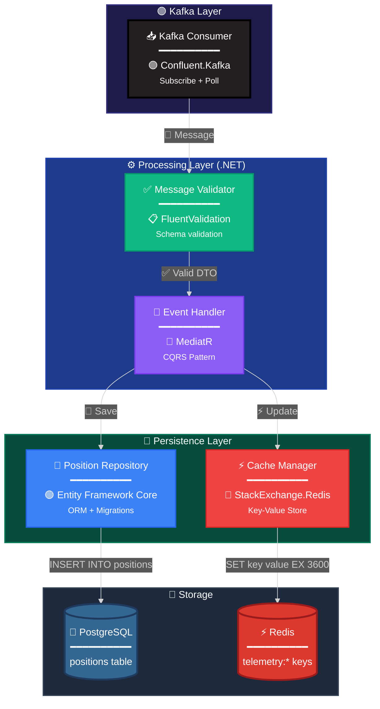

### Diagrama C4 - Nível 3: Componente (Consumer)

```mermaid
%%{init: {'theme':'dark'}}%%
graph TB
    subgraph KafkaLayer["🟣 Kafka Layer"]
        Consumer["📥 Kafka Consumer<br/>━━━━━━━━━━<br/>🟣 Confluent.Kafka<br/><small>Subscribe + Poll</small>"]
    end
    
    subgraph ProcessingLayer["⚙️ Processing Layer (.NET)"]
        Validator2["✅ Message Validator<br/>━━━━━━━━━━<br/>📋 FluentValidation<br/><small>Schema validation</small>"]
        Handler["🎯 Event Handler<br/>━━━━━━━━━━<br/>💎 MediatR<br/><small>CQRS Pattern</small>"]
    end
    
    subgraph PersistenceLayer["💾 Persistence Layer"]
        Repository["💾 Position Repository<br/>━━━━━━━━━━<br/>🟢 Entity Framework Core<br/><small>ORM + Migrations</small>"]
        CacheManager["⚡ Cache Manager<br/>━━━━━━━━━━<br/>🔴 StackExchange.Redis<br/><small>Key-Value Store</small>"]
    end
    
    subgraph StorageLayer["💾 Storage"]
        PG[("🐘 PostgreSQL<br/>━━━━━━━━━━<br/>positions table")]
        RD[("⚡ Redis<br/>━━━━━━━━━━<br/>telemetry:* keys")]
    end
    
    Consumer -->|"📨 Message"| Validator2
    Validator2 -->|"✅ Valid DTO"| Handler
    Handler -->|"💾 Save"| Repository
    Handler -->|"⚡ Update"| CacheManager
    Repository -->|"INSERT INTO positions"| PG
    CacheManager -->|"SET key value EX 3600"| RD
    
    style Consumer fill:#231F20,stroke:#000,stroke-width:3px,color:#fff
    style Validator2 fill:#10B981,stroke:#059669,stroke-width:2px,color:#fff
    style Handler fill:#8B5CF6,stroke:#7C3AED,stroke-width:2px,color:#fff
    style Repository fill:#3B82F6,stroke:#2563EB,stroke-width:2px,color:#fff
    style CacheManager fill:#EF4444,stroke:#DC2626,stroke-width:2px,color:#fff
    style PG fill:#336791,stroke:#1E3A5F,stroke-width:3px,color:#fff
    style RD fill:#DC382D,stroke:#991B1B,stroke-width:3px,color:#fff
    style KafkaLayer fill:#1E1B4B,stroke:#312E81,stroke-width:2px
    style ProcessingLayer fill:#1E3A8A,stroke:#1E40AF,stroke-width:2px
    style PersistenceLayer fill:#064E3B,stroke:#047857,stroke-width:2px
    style StorageLayer fill:#1E293B,stroke:#334155,stroke-width:2px
```
