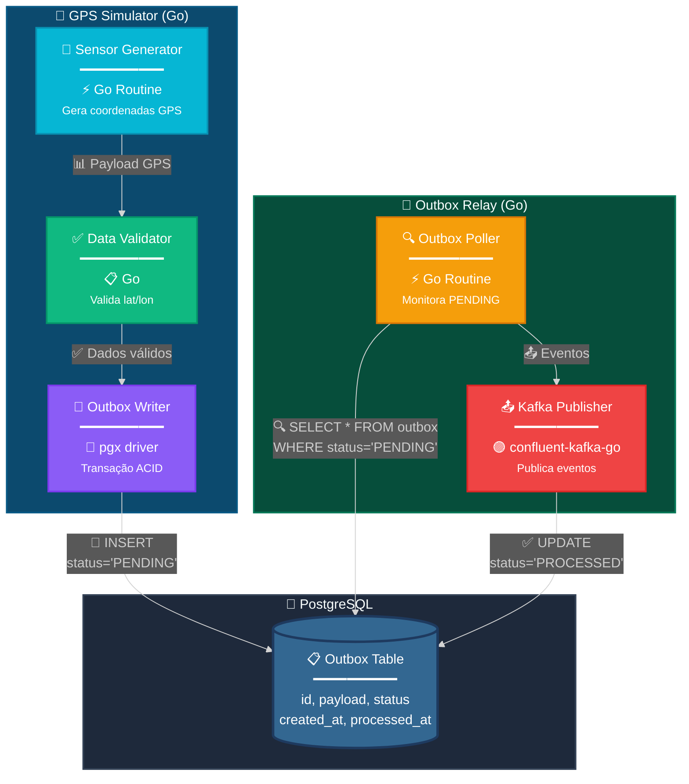

### Diagrama C4 - Nível 3: Componente (Producer)

```mermaid
%%{init: {'theme':'dark'}}%%
graph TB
    subgraph Simulator["📡 GPS Simulator (Go)"]
        Generator["🎲 Sensor Generator<br/>━━━━━━━━━━<br/>⚡ Go Routine<br/><small>Gera coordenadas GPS</small>"]
        Validator1["✅ Data Validator<br/>━━━━━━━━━━<br/>📋 Go<br/><small>Valida lat/lon</small>"]
        OutboxWriter["💾 Outbox Writer<br/>━━━━━━━━━━<br/>🔷 pgx driver<br/><small>Transação ACID</small>"]
    end
    
    subgraph Relay["🔄 Outbox Relay (Go)"]
        Poller["🔍 Outbox Poller<br/>━━━━━━━━━━<br/>⚡ Go Routine<br/><small>Monitora PENDING</small>"]
        Publisher["📤 Kafka Publisher<br/>━━━━━━━━━━<br/>🟣 confluent-kafka-go<br/><small>Publica eventos</small>"]
    end
    
    subgraph Database["💾 PostgreSQL"]
        OutboxTable[("📋 Outbox Table<br/>━━━━━━━━━━<br/>id, payload, status<br/>created_at, processed_at")]
    end
    
    Generator -->|"📊 Payload GPS"| Validator1
    Validator1 -->|"✅ Dados válidos"| OutboxWriter
    OutboxWriter -->|"💾 INSERT<br/>status='PENDING'"| OutboxTable
    Poller -->|"🔍 SELECT * FROM outbox<br/>WHERE status='PENDING'"| OutboxTable
    Poller -->|"📤 Eventos"| Publisher
    Publisher -->|"✅ UPDATE<br/>status='PROCESSED'"| OutboxTable
    
    style Generator fill:#06B6D4,stroke:#0891B2,stroke-width:2px,color:#fff
    style Validator1 fill:#10B981,stroke:#059669,stroke-width:2px,color:#fff
    style OutboxWriter fill:#8B5CF6,stroke:#7C3AED,stroke-width:2px,color:#fff
    style Poller fill:#F59E0B,stroke:#D97706,stroke-width:2px,color:#fff
    style Publisher fill:#EF4444,stroke:#DC2626,stroke-width:2px,color:#fff
    style OutboxTable fill:#336791,stroke:#1E3A5F,stroke-width:3px,color:#fff
    style Simulator fill:#0C4A6E,stroke:#075985,stroke-width:2px
    style Relay fill:#064E3B,stroke:#047857,stroke-width:2px
    style Database fill:#1E293B,stroke:#334155,stroke-width:2px
```
