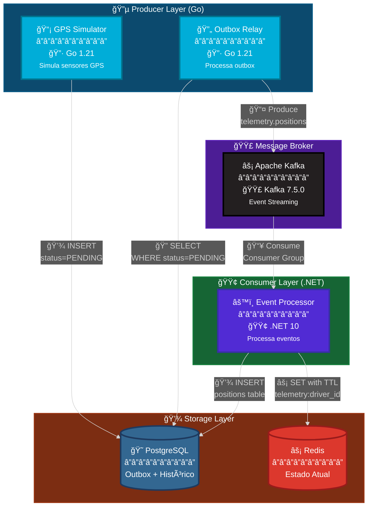

### Diagrama C4 - Nível 2: Container

```mermaid
%%{init: {'theme':'dark'}}%%
graph TB
    subgraph Producers["🔵 Producer Layer (Go)"]
        Simulator["📡 GPS Simulator<br/>â”â”â”â”â”â”â”â”â”â”<br/>🔷 Go 1.21<br/><small>Simula sensores GPS</small>"]
        Relay["🔄 Outbox Relay<br/>â”â”â”â”â”â”â”â”â”â”<br/>🔷 Go 1.21<br/><small>Processa outbox</small>"]
    end
    
    subgraph Broker["🟣 Message Broker"]
        Kafka["âš¡ Apache Kafka<br/>â”â”â”â”â”â”â”â”â”â”<br/>🟣 Kafka 7.5.0<br/><small>Event Streaming</small>"]
    end
    
    subgraph Consumers["🟢 Consumer Layer (.NET)"]
        Worker["âš™ï¸ Event Processor<br/>â”â”â”â”â”â”â”â”â”â”<br/>🟢 .NET 10<br/><small>Processa eventos</small>"]
    end
    
    subgraph Storage["💾 Storage Layer"]
        Postgres[("😠PostgreSQL<br/>â”â”â”â”â”â”â”â”â”â”<br/>Outbox + Histórico")]
        Redis[("âš¡ Redis<br/>â”â”â”â”â”â”â”â”â”â”<br/>Estado Atual")]
    end
    
    Simulator -->|"💾 INSERT<br/>status=PENDING"| Postgres
    Relay -->|"🔠SELECT<br/>WHERE status=PENDING"| Postgres
    Relay -->|"📤 Produce<br/>telemetry.positions"| Kafka
    Kafka -->|"📥 Consume<br/>Consumer Group"| Worker
    Worker -->|"💾 INSERT<br/>positions table"| Postgres
    Worker -->|"âš¡ SET with TTL<br/>telemetry:driver_id"| Redis
    
    style Simulator fill:#00ADD8,stroke:#00758F,stroke-width:3px,color:#fff
    style Relay fill:#00ADD8,stroke:#00758F,stroke-width:3px,color:#fff
    style Kafka fill:#231F20,stroke:#000,stroke-width:3px,color:#fff
    style Worker fill:#512BD4,stroke:#3730A3,stroke-width:3px,color:#fff
    style Postgres fill:#336791,stroke:#1E3A5F,stroke-width:3px,color:#fff
    style Redis fill:#DC382D,stroke:#991B1B,stroke-width:3px,color:#fff
    style Producers fill:#0C4A6E,stroke:#075985,stroke-width:2px
    style Broker fill:#4C1D95,stroke:#5B21B6,stroke-width:2px
    style Consumers fill:#166534,stroke:#15803D,stroke-width:2px
    style Storage fill:#7C2D12,stroke:#9A3412,stroke-width:2px
```
