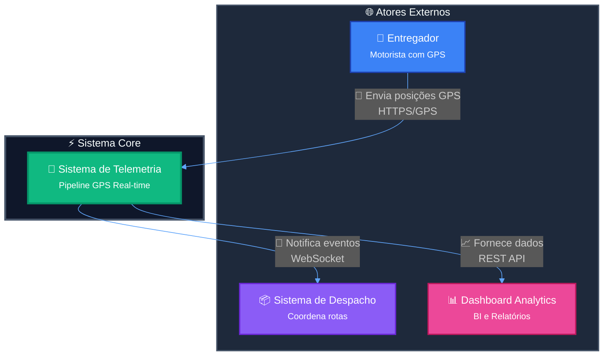

### Diagrama C4 - Nível 1: Contexto do Sistema

```mermaid
%%{init: {'theme':'dark', 'themeVariables': { 'primaryColor':'#00ADD8','primaryTextColor':'#fff','primaryBorderColor':'#00758F','lineColor':'#60A5FA','secondaryColor':'#512BD4','tertiaryColor':'#DC382D'}}}%%
graph TB
    subgraph External["🌐 Atores Externos"]
        Driver["👤 Entregador<br/><small>Motorista com GPS</small>"]
        Dispatch["📦 Sistema de Despacho<br/><small>Coordena rotas</small>"]
        Dashboard["📊 Dashboard Analytics<br/><small>BI e Relatórios</small>"]
    end
    
    subgraph Core["⚡ Sistema Core"]
        Telemetry["🎯 Sistema de Telemetria<br/><small>Pipeline GPS Real-time</small>"]
    end
    
    Driver -->|"📍 Envia posições GPS<br/>HTTPS/GPS"| Telemetry
    Telemetry -->|"🔔 Notifica eventos<br/>WebSocket"| Dispatch
    Telemetry -->|"📈 Fornece dados<br/>REST API"| Dashboard
    
    style Driver fill:#3B82F6,stroke:#1E40AF,stroke-width:2px,color:#fff
    style Dispatch fill:#8B5CF6,stroke:#6D28D9,stroke-width:2px,color:#fff
    style Dashboard fill:#EC4899,stroke:#BE185D,stroke-width:2px,color:#fff
    style Telemetry fill:#10B981,stroke:#059669,stroke-width:3px,color:#fff
    style External fill:#1E293B,stroke:#475569,stroke-width:2px
    style Core fill:#0F172A,stroke:#475569,stroke-width:3px
```
