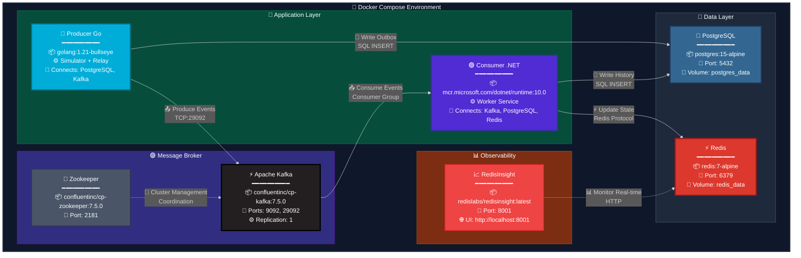

### Diagrama de Deployment

```mermaid
%%{init: {'theme':'dark'}}%%
graph TB
    subgraph DockerCompose["🐳 Docker Compose Environment"]
        subgraph DataLayer["💾 Data Layer"]
            PG["🐘 PostgreSQL<br/>━━━━━━━━━━<br/>📦 postgres:15-alpine<br/>🔌 Port: 5432<br/>💾 Volume: postgres_data"]
            RD["⚡ Redis<br/>━━━━━━━━━━<br/>📦 redis:7-alpine<br/>🔌 Port: 6379<br/>💾 Volume: redis_data"]
        end
        
        subgraph MessageBroker["🟣 Message Broker"]
            ZK["🔷 Zookeeper<br/>━━━━━━━━━━<br/>📦 confluentinc/cp-zookeeper:7.5.0<br/>🔌 Port: 2181"]
            KF["⚡ Apache Kafka<br/>━━━━━━━━━━<br/>📦 confluentinc/cp-kafka:7.5.0<br/>🔌 Ports: 9092, 29092<br/>⚙️ Replication: 1"]
        end
        
        subgraph ApplicationLayer["🎯 Application Layer"]
            PROD["🔵 Producer Go<br/>━━━━━━━━━━<br/>📦 golang:1.21-bullseye<br/>⚙️ Simulator + Relay<br/>🔗 Connects: PostgreSQL, Kafka"]
            CONS["🟢 Consumer .NET<br/>━━━━━━━━━━<br/>📦 mcr.microsoft.com/dotnet/runtime:10.0<br/>⚙️ Worker Service<br/>🔗 Connects: Kafka, PostgreSQL, Redis"]
        end
        
        subgraph Observability["📊 Observability"]
            RI["📈 RedisInsight<br/>━━━━━━━━━━<br/>📦 redislabs/redisinsight:latest<br/>🔌 Port: 8001<br/>🌐 UI: http://localhost:8001"]
        end
    end
    
    PROD -->|"💾 Write Outbox<br/>SQL INSERT"| PG
    PROD -->|"📤 Produce Events<br/>TCP:29092"| KF
    KF -->|"📥 Consume Events<br/>Consumer Group"| CONS
    CONS -->|"💾 Write History<br/>SQL INSERT"| PG
    CONS -->|"⚡ Update State<br/>Redis Protocol"| RD
    RI -.->|"📊 Monitor Real-time<br/>HTTP"| RD
    ZK -.->|"🔧 Cluster Management<br/>Coordination"| KF
    
    style PG fill:#336791,stroke:#1E3A5F,stroke-width:3px,color:#fff
    style RD fill:#DC382D,stroke:#991B1B,stroke-width:3px,color:#fff
    style ZK fill:#4A5568,stroke:#2D3748,stroke-width:2px,color:#fff
    style KF fill:#231F20,stroke:#000,stroke-width:3px,color:#fff
    style PROD fill:#00ADD8,stroke:#00758F,stroke-width:3px,color:#fff
    style CONS fill:#512BD4,stroke:#3730A3,stroke-width:3px,color:#fff
    style RI fill:#EF4444,stroke:#DC2626,stroke-width:2px,color:#fff
    style DockerCompose fill:#0F172A,stroke:#1E293B,stroke-width:3px
    style DataLayer fill:#1E293B,stroke:#334155,stroke-width:2px
    style MessageBroker fill:#312E81,stroke:#4C1D95,stroke-width:2px
    style ApplicationLayer fill:#064E3B,stroke:#065F46,stroke-width:2px
    style Observability fill:#7C2D12,stroke:#92400E,stroke-width:2px
```

